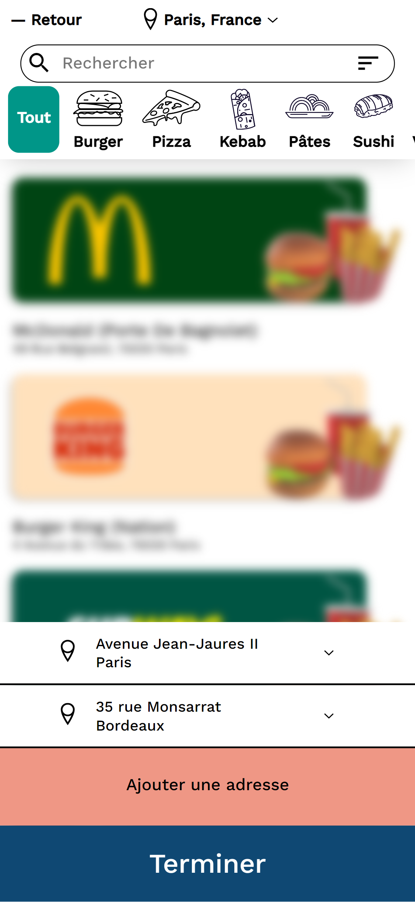
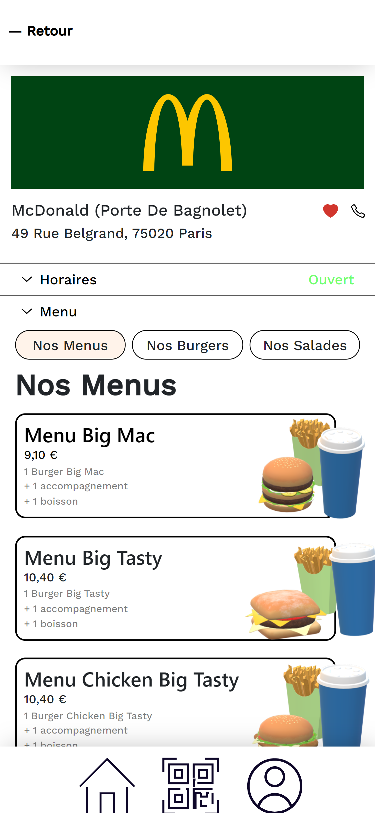
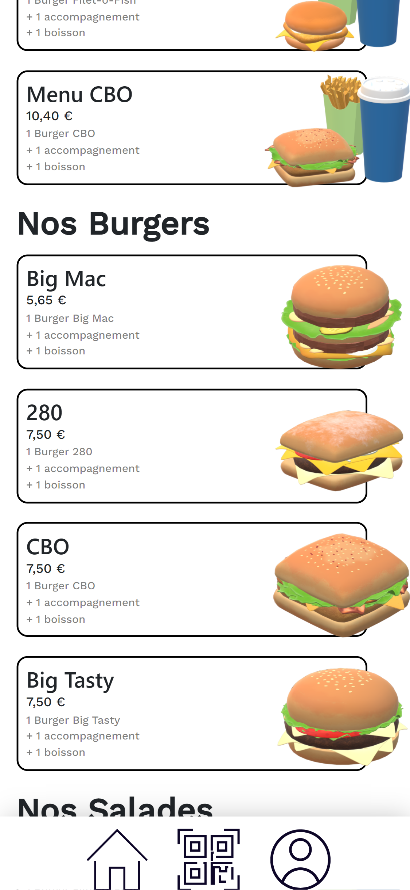
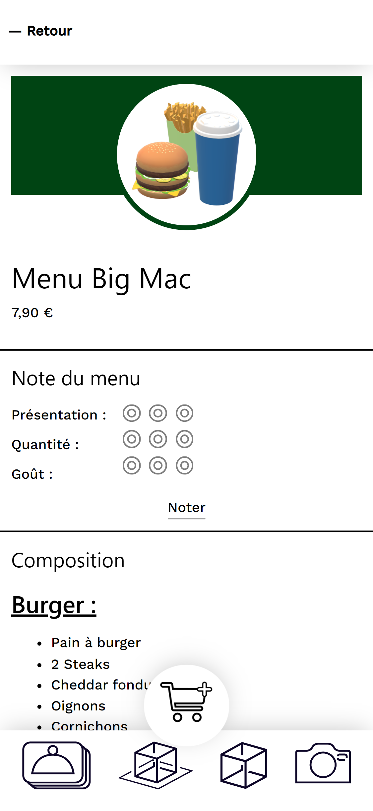
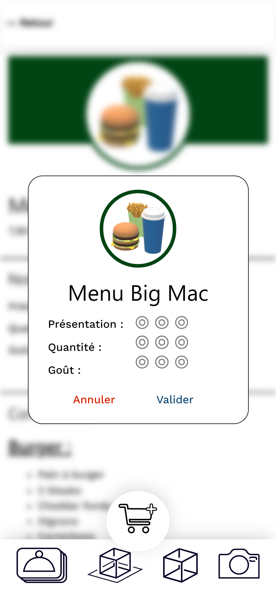
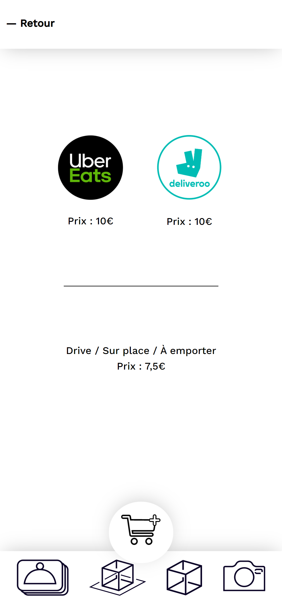
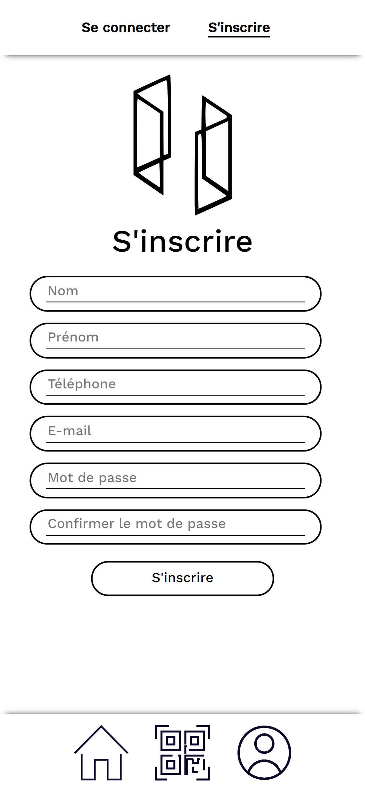

# PWA SPEAT

This repo contains the documentation and guides I redacted for a progressive web app (PWA) prototype whose development I supervised during an internship.
The app is meant to offer a collaborative food delivery service.

The source code is hosted on a private repo of mine and has been removed from this public repo as the app is considered proprietary software. All sensitive information regarding the company has also been removed.
If you still wish to get a demo of the app, please contact me at gibril.gunder@outlook.fr.

I have added a few screenshots of pages of the application we built during my internship (see bellow). Those illustrations only come from a prototype of the client app which is not yet linked to the back end logic (a REST API built with Symfony and API Platform whose development I also supervised partly). Most of the code for this front end was made by interns in less than 4 weeks with no review from more experienced developers. Thus, it is obviously flawed : I only captured a snapshot of the project when I left the company. My goal with this repo is not to showcase the source code - which is impossible anyway due to the fact that the app is proprietary, but rather illustrate the work I did when supervising the creation of this prototype.

All the documentation and guides within this repo are redacted in french. My goal was to write comprehensive resources for other junior developers and interns to quickly understand the project and get a handle on the source code.

Here are a few illustrations of pages of the app we built (you may find all the images used in this repo under <code>/documentation/images/</code>):

_____________________________________________________________________________

Application Web pour la consultation de cartes de restaurants et la livraison.

<strong>
  IMPORTANT : À LIRE JUSQU'AU BOUT !! LA SECTION "UTILISATION" À LA FIN DE CE README REDIRIGE VERS LES DOCUMENTATIONS DE L'API (BACKEND) ET DE L'APPLICATION CLIENT (FRONTEND).</strong>   

<h2>Organisation / architecture</h2>

Ce dossier contient l'application client et l'API REST qui fait office de serveur/backend.  
Ces deux parties sont complètement indépendantes et doivent être servies séparément.  
La communication entre l'application client et l'API utilise le processus CORS. 

L'application client se trouve dans le dossier <strong>SPEAT-client-app</strong>. Le dossier <strong>SPEAT-API</strong> contient l'API.   

Ce répo contient également un dossier <strong>documentation</strong> qui regroupe de la documentation sur le projet et l'application SPEAT (guides, aspects de spécification, de conception, ressources diverses pour se former, cerner le projet, etc...).  
Voir <code>/documentation/README.txt</code> pour plus d'explications sur le contenu et l'organisation de ce dossier.   

<h3>À propos de l'application client</h3>

<strong>
  IMPORTANT POUR LES DÉVELOPPEURS FRONT PRINCIPALEMENT :  
  Le design de l'application client est exposé dans <a href="">ce projet Figma</a> (lien supprimé pour protéger la propriété de l'entreprise). Merci de s'y   référer pour prendre connaissance des pages que doit posséder l'application client.
</strong>  
  
L'application client est une <i>Single Page Application</i> (SPA) (voir 
<a href="https://blog.octo.com/a-la-decouverte-des-architectures-du-front-3-4-les-single-page-applications/">ici</a>, 
<a href="https://www.bloomreach.com/en/blog/2018/07/what-is-a-single-page-application.html">ici</a>,  
<a href="https://medium.com/@NeotericEU/single-page-application-vs-multiple-page-application-2591588efe58">là</a>, ou 
<a href="./documentation/autres-ressources/spa-vs-conventional-web-app.pdf">ce schéma</a> qui explique la différence entre une SPA et une application Web conventionnelle) 
dotée de fonctionnalités d'une <i>Progressive Web Application</i> (PWA) (voir 
<a href="https://web.dev/progressive-web-apps/">cette introduction</a>, 
<a href="https://developer.mozilla.org/fr/docs/Web/Progressive_web_apps">ce guide</a>, ou
<a href="https://pwa-workshop.js.org/fr/">ce petit workshop</a> qui permet d'apprendre à mettre en place une PWA). 
L'application implémente, par exemple, un service worker (voir 
<a href="https://developer.mozilla.org/en-US/docs/Web/API/Service_Worker_API/Using_Service_Workers">ici</a>, ou 
<a href="https://serviceworke.rs/">là</a>). 

En tant que PWA, l'application client est conçue pour être utilisée comme une application native. Elle peut être installée facilement sur une grande variété d'environnements différents (Windows, Linux, Android, iOS, etc...) sans ajustements nécessaires. Cela est permis par les technologies Web qui sont utilisées pour sa conception. De plus, l'installation de l'application ne nécessite pas de passer par un store (les conventionnels App Store et Play Store) : l'application client peut être utilisée dans un navigateur, mais peut aussi être installée comme application native depuis ce navigateur.  

L'application client est construite autour d'AngularJS (Angular 0.* et 1.\*; Pour plus de détails, consulter le <a href="https://angularjs.org/">site</a> d'AngularJS, ou <a href="https://www.w3schools.com/angular/default.asp">ce cours</a>). 

<strong>Un changement de framework/bibliothèque frontend est fortement conseillé : AngularJS ne sera plus maintenu au delà de décembre 2021.</strong>   

<h3>À propos de l'API</h3>

Le "serveur" est une API REST implémentée avec Symfony et API Platform (voir la <a href="https://api-platform.com/docs">documentation</a>). L'application client y fait appel pour récupérer des données au format JSON majoritairement (les informations des restaurants, des produits, etc...).   

<h2>Utilisation</h2>

Les instructions d'utilisation de l'application client sont disponibles <a href="./SPEAT-client-app/README.md">ici</a>.  
Les instructions d'utilisation de l'API sont disponibles <a href="./SPEAT-API/README.md">ici</a>.
