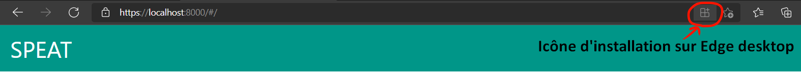

# Application client SPEAT

L'application client (PWA + SPA) installable.   

<h2>Guide de développement</h2>

<strong><mark>IMPORTANT POUR LES DÉVELOPPEURS !</mark></strong> 
Un guide de prise en mains de l'application pour les développeurs est disponible <a href="../documentation/guides/client-app-guide.md">ici</a>.   

<h2>Utilisation</h2>

<h3>Lancer l'application avec un serveur local</h3>

Pour que l'application soit considérée comme une PWA, elle doit être servie via HTTPS. En production, l'application devra donc être servie via HTTPS.  
Cependant, il est aussi possible de servir l'application via HTTP. Dans ce cas, elle ne sera pas installable : toutes ses fonctionnalités seront toujours disponibles, mais l'application ne sera utilisable que depuis un navigateur.

En environnement de développement, pour servir l'application via HTTPS en local, on aura donc besoin d'un serveur de développement supportant HTTPS. On peut, par exemple, utiliser <a href="https://github.com/http-party/http-server#readme">http-server</a> (suivre les instructions d'installation).

NOTE : Pour installer http-server, j'ai utilisé npm, le gestionnaire de paquets de Node.js. J'ai installé npm avec Node.js 
<a href="https://nodejs.org/en/">ici</a>.

Une fois http-server installé, on peut utiliser les scripts <code>/helper-scripts/serve.sh</code> (pour Bash, systèmes UNIX-like) ou  
<code>/helper-scripts/serve.bat</code> (pour Batch, Windows) pour lancer l'application.  
Ces scripts permettent de lancer http-server, et de servir l'application à l'adresse localhost, sur le port 8000. Ce comportement peut être personnalisé en modifiant ces scripts (pas recommandé), ou en lançant http-server (ou tout autre serveur local) manuellement.

Pour que l'application soit servie via HTTPS, il est nécessaire de disposer d'un certificat et d'une clé privée TLS/SSL.  
Chaque développeur travaillant sur l'application devra générer localement son propre couple certificat/clé privée pour servir l'application via HTTPS. 

NOTE : Il n'est pas nécessaire de générer ce couple pour lancer l'application. Sans certificat, ni clé privée TLS/SSL, l'application ne peut être servie que via HTTP. Les scripts <code>/helper-scripts/serve.sh</code> et <code>/helper-scripts/serve.bat</code> lancent alors http-server pour servir l'application via HTTP. Lorsque l'application est servie via HTTP, elle n'est pas installable (cf. section suivante).

Pour générer un couple certificat/clé privée TLS/SSL localement, on peut utiliser <a href="https://github.com/FiloSottile/mkcert#readme">l'utilitaire mkcert</a>.  
Après avoir installé mkcert, on peut utiliser les scripts <code>/helper-scripts/https-init.sh</code> ou <code>/helper-scripts/https-init.bat</code> (encore une fois, selon l'OS) pour générer ce couple.  
Ces scipts permettent d'automatiser la création d'un certificat et d'une clé privée TLS/SSL. Ils peuvent être exécutés à tout moment.

Concrètement, ils exécutent les commandes/instructions suivantes (qui peuvent être réalisées manuellement en cas de problème) :   

<ol>
    <li>Créer un répertoire <code>/tls/</code>.</li>
    <li>Configurer une autorité de certification TLS/SSL locale grâce à mkcert via la commande <code>mkcert -install</code>.</li>
    <li>Créer un certificat et une clé privée TLS/SSL dans le répertoire <code>/tls/</code>. Le certificat est dans le fichier <code>certificate.pem</code>, et la clé privée dans <code>private-key.pem</code>.</li>
</ol>  

ATTENTION : Comme chaque développeur testant l'application possède son propre couple certificat/clé privée, le répertoire <code>/tls/</code> doit rester local (ne pas être géré par Git). Le <code>/.gitignore</code> de l'application est configuré pour ignorer ce dossier, et les fichiers portant l'extension <code>.pem</code> de manière générale.

REMARQUE : La procédure utilisée pour servir l'application via HTTPS est la même que celle exposée dans <a href="https://pwa-workshop.js.org/fr/#developpement-local-avec-ssl">ce petit workshop</a>.   

Après création d'un certificat et d'une clé TLS/SSL dans <code>/tls/</code>, <code>/helper-scripts/serve.sh</code> et <code>/helper-scripts/serve.bat</code> peuvent lancer http-server pour servir l'application via HTTPS.   

<strong>Une fois le serveur lancé, on peut accéder à l'application sur http://localhost:8000 ou https://localhost:8000, selon que l'application est servie via HTTP ou HTTPS.</strong>  

<h3>Installer l'application en tant qu'application pseudo-native</h3>

L'application peut être utilisée dans un navigateur. Elle peut aussi être installée en natif depuis ce navigateur. La majorité des navigateurs offrent aujourd'hui la possibilité d'installer un raccourci vers l'application sur l'écran d'accueil de l'appareil de l'utilisateur (fonctionnalité <a href="https://developer.mozilla.org/fr/docs/Web/Progressive_web_apps/Add_to_home_screen">A2HS</a>).  

Voici quelques exemples :   

<figure>
    
    <figcaption>Icône d'installation sur Chrome desktop</figcaption>
</figure>
   
<figure>
    
    <figcaption>Icône d'installation sur Edge desktop</figcaption>
</figure>
   
<figure>
    
    <figcaption>Icône d'installation sur Firefox pour Android (<a href="https://developer.mozilla.org/fr/docs/Web/Progressive_web_apps/Add_to_home_screen">source</a>)</figcaption>
</figure>
   
Voici un exemple de rendu de l'application une fois installée :   

<figure>
    
    <figcaption>Vue de l'application exécutée de manière native sous Windows (en vue smartphone)</figcaption>
</figure>
