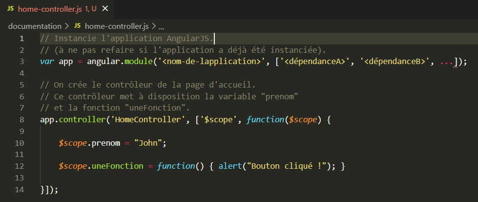

<h1>Guide de développement pour l'application client</h1>

Avant toute chose, il est important de parcourir <a href="https://www.w3schools.com/angular/default.asp">ce guide</a> pour prendre en mains AngularJS rapidement (4 jours de formation devraient largement suffir pour quelqu'un avec des notions de JS).  
À tout moment, il peut aussi être intéressant de parcourir <a href="https://docs.angularjs.org/guide">la documentation d'AngularJS</a>, ou ce 
<a href="https://grafikart.fr/formations/angularjs">tutoriel</a>.   

<h2>Structure de l'application</h2>

L'application possède l'arborescence de dossiers de base suivante :

<pre>
/
|------------assets/
|                  |-------------icons/
|
|---------------css/
|
|----helper-scripts/
|
|----------------js/
|                  |---------libraries/
|
|-------------pages/
|                  |-------------page1/
|                  |-------------page2/
|                  |...
|
|---------------tls/
|
|---------index.html
|------manifest.json
|--service-worker.js
</pre> 

Bien que l'application soit une SPA (<i>Single Page Application</i>), elle possède en réalité plusieurs pages. Ces pages peuvent être vues comme plusieurs sections d'une même grande page envoyée en une fois au client. L'application s'occupe alors d'afficher les bonnes sections de cette grande page selon les besoins de l'utilisateur (mécanisme de routage).   

<ul>
    <li>
Les fichiers spécifiques aux pages de l'application se trouvent dans le dossier <code>/pages/</code>.  
Chaque page possède un sous-répertoire propre dans ce dossier (dans l'exemple ici, <code>page1/</code> et <code>page2/</code>).  
Pour créer une nouvelle page dans l'application, on crée donc un nouveau répertoire dans le dossier <code>/pages/</code>.  
Par exemple, pour créer une page d'accueil, on pourra créer un répertoire <code>home/</code> ou <code>homePage/</code> (le nom est libre) dans <code>/pages/</code>.  
Ce répertoire contiendra tous les fichiers spécifiques à la page d'accueil (généralement une template HTML, un contrôleur, une feuille de styles éventuellement : voir plus bas dans la documentation pour plus de détails).   
    </li>
    <li>
Le répertoire <code>/js/</code> contient tous les fichiers JS utilisés de manière globale dans l'application (non-spécifiques à une page en particulier). Il contient en particulier le code des bibliothèques/packages utilisés dans le sous-répertoire <code>librairies/</code>. On peut donc trouver dans <code>/js/librairies/</code> le code d'AngularJS (<code>angular.min.js</code>), du routeur utilisé (<code>angular-ui-router.min.js</code> : voir plus bas pour plus de détails sur le routeur), etc...  
Le répertoire <code>/js/</code> contient par exemple le script permettant d'initialiser l'application AngularJS (<code>app.js</code>), des factories (voir plus bas pour plus de détails), etc...   
    </li>
    <li>
Le répertoire <code>/css/</code> est l'équivalent du dossier <code>/js/</code> pour les feuilles de styles CSS.   
    </li>
    <li>
Le répertoire <code>/assets/</code> contient des ressources statiques (images, autres fichiers, etc...) comme les icônes de l'application contenues dans <code>/assets/icons/</code>. Ces icônes sont utilisées dans <code>manifest.json</code>.   
    </li>
    <li>
Le répertoire <code>/tls/</code> contient le certificat et la clé TLS/SSL utilisés pour servir l'application avec HTTPS. Ce répertoire n'est pas suivi par Git : chaque développeur possède son propre couple certificat/clé privée TLS/SSL. Voir la section "Lancer l'application avec un serveur local" 
<a href="../../SPEAT-client-app/README.md">ici</a>.   
    </li>
    <li>
Le répertoire <code>/helper-scripts/</code> contient des scripts Bash et Batch utilitaires (permettant de lancer l'application, de générer des couples certificat/clé TLS/SSL, etc...). Une section dédiée, plus bas dans ce guide, donne la fonction de chacun des scripts contenus dans ce dossier.   
    </li>
    <li>
Le fichier <code>/manifest.json</code> permet à l'application d'être considérée comme une PWA, et d'être ainsi installable (voir <a href="https://web.dev/add-manifest/">ici</a> pour plus de détails).   
    </li>
    <li>
Le fichier <code>/service-worker.js</code> donne l'implémentation du service worker de l'application.   
    </li>
    <li>
Le fichier <code>/index.html</code> est le point d'entrée de l'application.   
    </li>
</ul>

<h2>Utiliser les scripts de <code>/helper-scripts/</code> pour aller plus vite</h2>

Voilà la liste des scripts contenus dans le répertoire <code>/helper-scripts/</code> :   

Par défaut, ces scripts peuvent être exécutés n'importe où (sauf indication contadictoire explicite au cas par cas). 

Pour les utilisateurs de Windows, utiliser les versions <code>\*.bat</code>.  
Pour les utilisateurs de systèmes UNIX-like (Linux, MacOS, etc...), utiliser les versions <code>\*.sh</code> (avec Bash).   

<ul>
    <li>
<code>serve.*</code> : lance l'application à l'adresse localhost, sur le port 8000 avec <a href="https://github.com/http-party/http-server#readme">http-server</a>. L'application est servie via HTTP ou HTTPS selon qu'un couple certificat/clé privée TLS/SSL est disponible dans <code>/tls/</code> ou non.   
    </li>
    <li>
<code>https-init.*</code> : automatise la génération d'un couple certificat/clé privée TLS/SSL dans <code>/tls/</code> (nécessaire pour servir l'application via HTTPS). Pour ce faire, utilise <a href="https://github.com/FiloSottile/mkcert#readme">l'utilitaire mkcert</a>.   
    </li>
</ul>

<h2>Quelques notions sur AngularJS pour bien prendre en mains l'application</h2>

AngularJS est un petit framework JavaScript permettant de réaliser des SPAs (<i>Single Page Applications</i>).  
Pour plus d'informations sur le principe d'une SPA et le role d'AngularJS dans ce type d'application, aller voir <a href="">cette ressource</a>.

L'application est un module AngularJS (<code>angular.module</code>) (<a href="https://www.w3schools.com/angular/angular_modules.asp">plus d'info</a>). Ce module contient des composants fournis par AngularJS.

<figure>
    
    <figcaption>Création de l'application en tant que module AngularJS dans <code>/js/app.js</code></figcaption>
</figure>   

AngularJS met à disposition différents types de composants (contrôleurs, factories, services, etc...). Un composant possède un nom, et une liste de dépendances.  
AngularJS fonctionne avec une logique d'injection de dépendances : chaque fois qu'on crée un composant, on peut lui injecter des utilitaires appelés dépendances. Le composant pourra ensuite utiliser les fonctionnalités offertes par ses dépendances. 

Le module qui représente l'application est un composant particulier. Dans l'exemple ci-dessus, il a le nom "App", une unique dépendance du nom de <code>ui.router</code>, et est stocké dans la variable <code>app</code>.  
C'est à partir de cette variable qu'on va pouvoir ajouter des composants à notre application AngularJS.   

La syntaxe générale est la suivante :

  

En fait, comme le montre l'exemple ci-dessus, les composants AngularJS sont des objets JS créés avec des <i>factory functions</i> (les fonctions nommées <code>\<type-composant\></code> dans l'exemple). Plus d'informations sur l'injection de dépendances et la création de composants avec les <i>factory functions</i> d'AngularJS 
<a href="https://docs.angularjs.org/guide/di">ici</a>. Pour une petite introduction aux <i>factory functions</i> en JS, voir <a href="https://www.youtube.com/watch?v=ImwrezYhw4w">ici</a>.

Nous utiliserons majoritairement deux types de composants spécifiques : les <a href="https://www.w3schools.com/angular/angular_controllers.asp">contrôleurs</a> et les factories (se rapprochent des <a href="https://www.w3schools.com/angular/angular_services.asp">services</a> ;
voir <a href="https://stackoverflow.com/questions/15666048/angularjs-service-vs-provider-vs-factory?noredirect=1&lq=1">ici</a> pour comprendre la différence entre un service et une factory). Leurs fonctionnements sont détaillés plus bas.

AngularJS permet d'étendre le code HTML de l'application avec <a href="https://www.w3schools.com/angular/angular_directives.asp">des directives</a>.  
AngularJS permet de modifier dynamiquement le code HTML de l'application avec le concept de <a href="https://www.w3schools.com/angular/angular_databinding.asp"><i>data binding</i></a>.   

<h3>Les contrôleurs</h3>

Dans AngularJS, un contrôleur est un script JS qui va pouvoir être attaché à des éléments du DOM (éléments HTML). Concrètement, un contrôleur encapsule une fonction qui définit des propriétés et méthodes. Ces propriétés et méthodes pourront ensuite être utilisées dans l'élément du DOM (et ses enfants) auquel est associé le contrôleur.  
Voici deux manières de créer un contrôleur :

<figure>
    
    <figcaption>
        Créer un contrôleur. La section "Dependency Annotation" de <a href="https://docs.angularjs.org/guide/di">cette page de la documentation d'AngularJS</a> explique pourquoi privilégier la méthode 2.
    </figcaption>
</figure>   

Aller voir <a href="https://www.w3schools.com/angular/angular_controllers.asp">ici</a> ou <a href="https://docs.angularjs.org/guide/controller">là</a> pour comprendre le fonctionnement des contrôleurs.   

Dans l'application, par défaut, on crée un contrôleur par page, sauf si ce n'est vraiment pas nécessaire.  
Mettons que l'on veuille créer une page d'accueil dans l'application. Pour cela, on peut suivre les étapes suivantes :

<ol>
    <li>Créer le répertoire <code>/pages/home/</code></li>
    <li>Créer le fichier HTML de la page (<code>home.html</code> par exemple) dans <code>/pages/home/</code></li>
    <li>Créer un contrôleur pour la page dans un fichier séparé (<code>home-controller.js</code> par exemple) dans <code>/pages/home/</code></li>
    <li>Ne pas oublier de lier le contrôleur dans <code>/index.html</code> en ajoutant une balise  <code>&ltscript src="/pages/home/homeController.js"&gt&lt/script&gt</code></li>
</ol>  

La structure HTML de chaque page est contenue dans une <code>\<div\></code> contrôlée par un contrôleur. Pour l'exemple de la page d'accueil, on pourrait avoir :

<figure>
    
    <figcaption>Le contrôleur de la page d'accueil. <code>$scope</code> est un objet fourni par AngularJS encapsulant toutes les propriétés et méthodes définies par le contrôleur. Cet objet fait référence à la notion de <i>scope</i> (voir <a href="https://www.w3schools.com/angular/angular_scopes.asp">ici</a> ou 
<a href="https://docs.angularjs.org/guide/scope">là</a>).</figcaption>
</figure>   
<figure>
    
    <figcaption>Le code HTML de la page d'accueil</figcaption>
</figure>   

On lie HomeController au niveau du point d'entrée de l'application (<code>/index.html</code>) :

<figure>
    
    <figcaption>Importer home-controller.js au niveau du point d'entrée de l'application (ici, dans la balise <code>&lthead&gt</code> de <code>/index.html</code>).</figcaption>
</figure>  

<h3>Les factories</h3>
    
Les <i>factories</i> d'AngularJS sont des composants qui encapsulent des <i>factory functions</i> classiques. 
    
La syntaxe permettant de créer une factory AngularJS est similaire à celle permettant de créer des contrôleurs :

<figure>
    
    <figcaption>
        Créer une factory. La section "Dependency Annotation" de <a href="https://docs.angularjs.org/guide/di">cette page de la documentation d'AngularJS</a> explique pourquoi privilégier la méthode 2.
    </figcaption>
</figure>   

Dans l'exemple ci-dessus, on utilise donc la <i>factory function</i> <code>factory</code> d'AngularJS pour créer... une <i>factory function</i> (la fonction encapsulée dans la factory AngularJS).  
Dès que notre factory AngularJS sera injectée en tant que dépendance d'un autre composant de notre application, la fonction qu'elle encapsule sera automatiquement exécutée. On pourra donc exploiter sa valeur de retour dans ce composant.   

Voilà un exemple :

<ol>
    <li>
        On crée une factory AngularJS dans répertoire <code>/js/</code>. Dans cet exemple, on va créer une factory nommée "TestFactory" dans le fichier <code>/js/test-factory.js</code>.   
        <figure>
            
            <figcaption>Un exemple de factory AngularJS</figcaption>
        </figure>
    </li>  
    <li>
        On utilise cette factory dans d'autres composants.   
        <figure>
            
            <figcaption>Exemple d'utilisation de TestFactory dans HomeController</figcaption>
        </figure>
    </li>  
    <li>
        On lie notre nouvelle factory AngularJS au niveau du point d'entrée de l'application (<code>/index.html</code>).   
        <figure>
            
            <figcaption> Importer test-factory.js au niveau du point d'entrée de l'application (ici, dans la balise <code>&lthead&gt</code> de <code>/index.html</code>).</figcaption>
        </figure>
    </li>
</ol> 

<strong>Remarque : On peut utiliser les factories AngularJS pour partager des données entre contrôleurs. C'est quelque chose qu'on aura souvent besoin de faire. <a href="https://www.geeksforgeeks.org/how-to-share-data-between-controllers-in-angularjs/">Ce petit article</a> explique bien les différentes manières de mettre en place un mécanisme de communication inter-contrôleurs avec AngularJS.</strong>  

<h2>Le routage dans l'application</h2>

Le routage permet d'afficher les bons contenus selon les besoins de l'utilisateur. Si, par exemple, l'utilisateur souhaite naviguer d'une page A vers une page B, le routage permet cette transition.  
Comme l'application est une SPA et que l'ensemble du code HTML décrivant la structure des pages est déjà entièrement à la disposition de l'application client (pas besoin de "construire" du HTML au niveau du serveur), le routage dans l'application consiste à afficher les bonnes portions de code HTML selon les besoins de l'utilisateur.

Pour réaliser cette fonction de routage, on utilise un routeur qui prend la forme d'une petite bibliothèque JS.  
Nous n'utilisons pas <a href="https://www.w3schools.com/angular/angular_routing.asp">le routeur par défaut d'AngularJS (ngRoute)</a> mais un routeur tiers : <a href="https://ui-router.github.io/ng1/tutorial/helloworld">ui-router</a> plus flexible et simple d'utilisation.   

<h3>Configuration du routeur</h3>

Ui-router est configuré dans le fichier au sein duquel l'application AngularJS est initialisée et configurée (<code>/js/app.js</code>). 

<figure>
    
    <figcaption>Configuration d'ui-router dans <code>/js/app.js</code>. Les services <code>$stateProvider</code> et <code>$urlRouterProvider</code> sont fournis par ui-router.</figcaption>
</figure>  

<h3>Redirection et gestion de la navigation</h3>

Pour la navigation de pages en pages, ui-router fournit le service <code>$state</code>. En particulier, ce service possède une méthode <code>go</code> qui permet de rediriger vers la route dont le nom est fourni en argument.  
<code>$state.go('home')</code> redirige donc vers la route nommée "home".   

Voilà un exemple d'utilisation de <code>$state</code> de ui-router :

<figure>
    
    <figcaption>Exemple : utilisation de <code>$state</code> de ui-router dans le contrôleur de la page d'accueil</figcaption>
</figure>   
<figure>
    
    <figcaption>Exemple : redirection dans la template HTML de la page d'accueil</figcaption>
</figure>   

Lorsqu'une redirection a lieu, ui-router charge les éléments HTML de la template associée à la route demandée (voir section "Configuration du routeur"), et les ajoute dans l'élément du DOM portant l'attribut <code>ui-view</code>.  
Dans notre cas, cet élément est une <code>\<div\></code> située dans le point d'entrée de l'application (<code>/index.html</code>).  
Tous les scripts JS associés à cette template (inclus via des balises <code>\<script></code> ou des directives AngularJS comme <code>ng-controller</code>) sont chargés à ce moment là.

<figure>
     dans laquelle les templates HTML des pages sont chargées">
    <figcaption>La <code>&ltdiv&gt</code> dans laquelle les templates HTML des pages sont chargées dans <code>/index.html</code></figcaption>
</figure>  

<h2>Faire des requêtes HTTP depuis l'application vers des serveurs distants</h2>

L'application client aura besoin de faire des requêtes à l'API SPEAT, mais aussi à d'autres APIs utilisées pour des services divers (géolocalisation, géocoding, réalité augmentée, 3D, etc...). 

<strong>Remarque : les APIs remplacent les plug-ins dans des environnements comme WordPress. Voilà <a href="https://www.programmableweb.com/category/all/apis">une liste d'APIs publiques</a> qui peuvent s'avérer très utiles.</strong>   

Avec AngularJS, les requêtes HTTP se font à l'aide du service <a href="https://www.w3schools.com/angular/angular_http.asp"><code>$http</code></a>. Ce service fournit un certain nombre de méthodes qui correspondent aux principaux verbes HTTP.  
Les requêtes HTTP faîtes par <code>$http</code> sont par défaut asynchrones (<a href="https://developer.mozilla.org/en-US/docs/Learn/JavaScript/Asynchronous/Introducing">JS synchrone VS asynchrone : une introduction</a>). Les fonctions offertes par <code>$http</code> renvoient donc naturellement des <a href="https://developer.mozilla.org/fr/docs/Web/JavaScript/Guide/Using_promises">promesses</a>.

On peut toujours forcer une requête émise avec <code>$http</code> à se comporter comme une requête synchrone en indiquant expressément vouloir attendre la réponse du serveur distant. 
    
Pour cela, on peut utiliser la syntaxe <code>async/await</code> :

<figure>
    
    <figcaption>
        Exemple : forcer une requête faîte par <code>$http</code> à être synchrone. Bien qu'il soit possible de forcer un comportement synchrone des fonctions de <code>$http</code>, mieux vaut utiliser leur comportement asynchrone naturel autant que possible. Ce comportement fait tout leur avantage : pouvoir faire des requêtes asynchrones, c'est avoir la possibilité des ne pas bloquer l'application 
        en attente d'une réponse. On peut donc faire des requêtes dans le dos de l'utilisateur sans qu'il s'en aperçoive, de manière à garantir que les données soient prêtes le moment voulu. Le lazy-loading repose sur cela (très utile pour <a href="https://web.dev/browser-level-image-lazy-loading/">charger des images progressivement</a>).
    </figcaption>
</figure>  

<h2>Tester l'application</h2>

L'application étant entièrement contenue côté client (SPA), la plupart des navigateurs mettent en cache les fichiers qui
la composent. De fait, des modifications de l'application peuvent ne pas être "vues" par le navigateur après avoir
rafraîchi une partie de l'application (rafraîchir la page normalement ne suffit pas pour voir les modifications apportées dans le code).  
Dans ce cas, il peut être nécessaire de vider les entrées de cache du navigateur associées à l'application.  
Sur Chrome desktop, il est possible de faire cela en suivant les étapes suivantes :

<ol>
    <li>Afficher les outils de développement avec un clic droit sur la page, puis en sélectionnant "Inspecter" dans le
        menu contextuel</li>
    <li>Faire un clic droit sur l'icône de rafraîchissement et selectionner "Vider le cache et effectuer une
        actualisation forcée" dans le menu contextuel</li>
</ol>
 
<figure>
    
    <figcaption>Actualisation forcée sur Chrome desktop</figcaption>
</figure>   
    
Il n'est pas encore possible de rafraîchir une page sur la version installée de l'application. Pour que des modifications apportées au code puissent être visualisées dans la version installée de l'application, cette dernière doit être fermée, puis ré-ouverte après l'avoir rafraîchie dans un navigateur.   
    
<h2>Supprimer l'application une fois installée</h2>

<figure>
    
    <figcaption>Exemple: désinstaller l'application installée par Chrome sous Windows</figcaption>
</figure>
